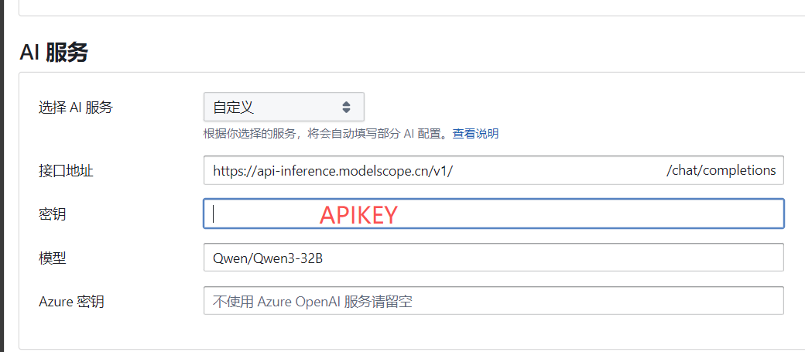
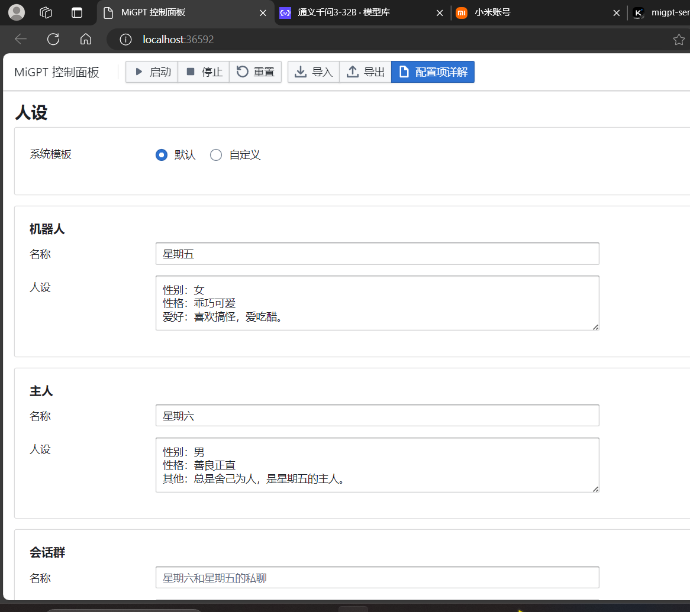
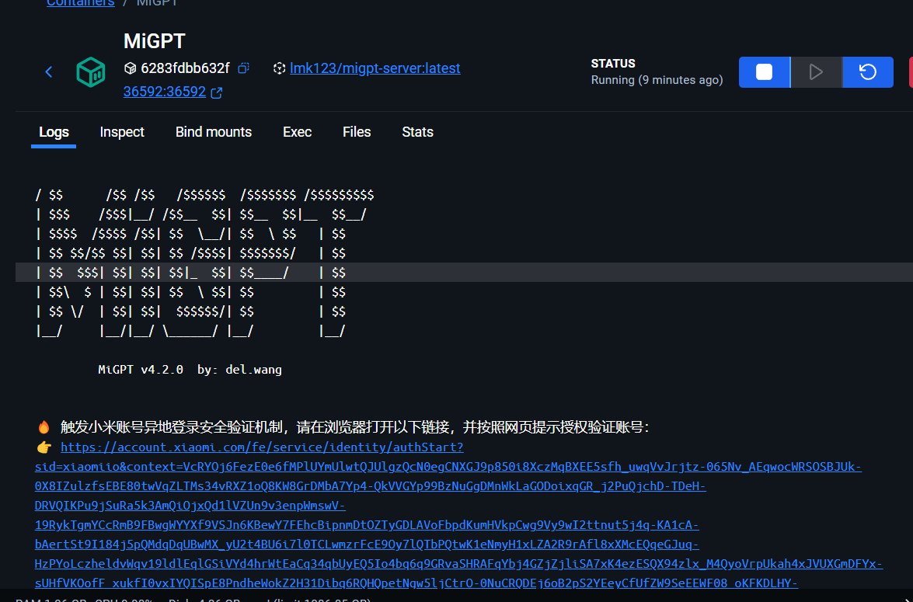
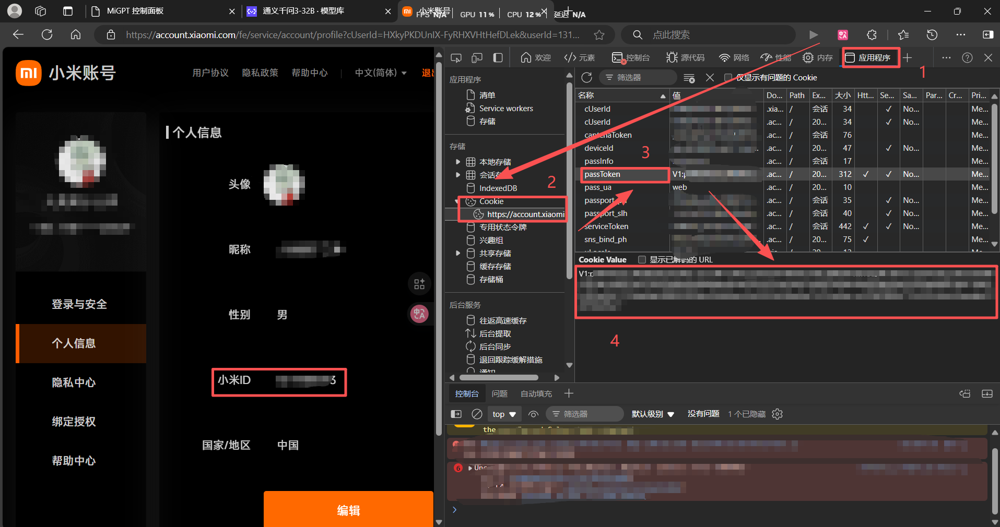
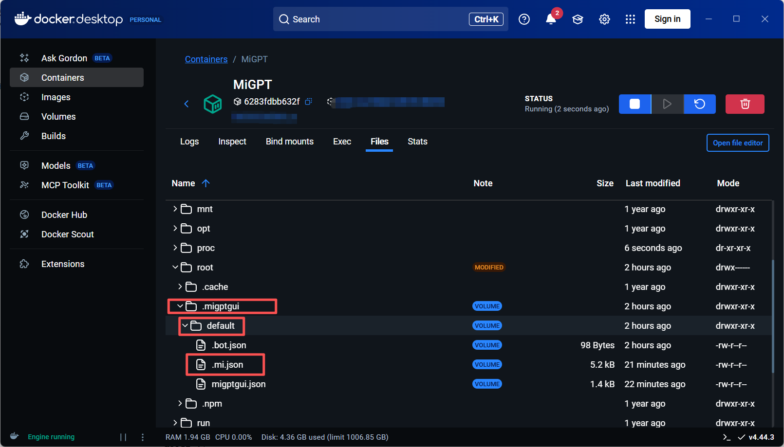
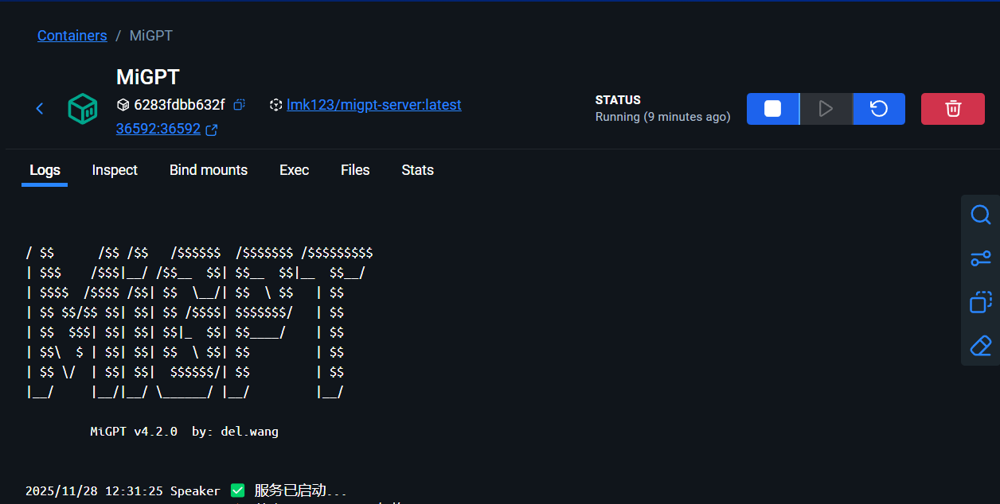

# MiGPT使用教程

前置条件：会使用docker，了解API调用逻辑

## docker安装镜像

一切默认设置，端口号用默认的36592

```
docker pull lmk123/migpt-server
```


## 启动容器，进入webUI

可自定义设置，也可直接导入我的设置：migptgui.json

注意，我使用的是魔塔API，需要你自己填写api key




设置好后，点击启动




## 此刻需要验证，为了本地永久验证，需要获取passtoken



## 打开小米官网

### 小米官网

```html
https://account.xiaomi.com/
```


## 登录后， 按F12

应用程序--cookie--passtoken--下方v1的所有内容全选复制




## docker打开(保持启动)files，更改json日志

## 将复制的token粘贴到.mi.json中

在docker的/.migptgui/default/下



## 删除原先的内容，将你的passToken粘贴到两个引号中

### .mi.json

```json
{
  "mina":{
    "pass":{
      "passToken":""
    }
  },
  "miiot":{
    "pass":{
      "passToken":""
    }
  }
}
```


## 保存后，重启容器

刷新webUI，点击启动，docker中显示如下，则启动成功


